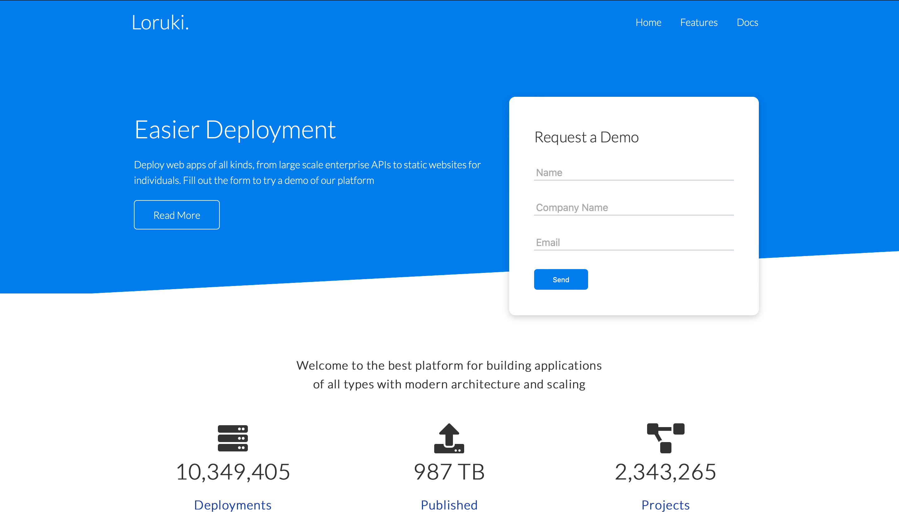

# Lokuri Cloud Hosting

This platform is a versatile tool for developers looking to build a wide variety
of applications. Its modern architecture allows for scalability and flexibility,
making it a great choice for projects of all sizes and complexity levels.
Whether you're building a simple website or a complex web application, this
platform provides the tools you need to create a robust and reliable product.

One of the key benefits of this platform is its scalability. As your application
grows and your user base expands, this platform can easily handle the increased
traffic and demand. Its architecture is designed to be scalable and resilient,
ensuring that your application stays up and running even during peak usage
times.

In addition to its scalability, this platform also offers modern features and
tools that make it easy to build applications quickly and efficiently. Its
modern architecture is designed to support popular programming languages,
frameworks, and libraries, so you can use the tools you're already familiar with
to build your application.

Overall, this platform is a powerful tool for developers looking to build
applications with modern architecture and scalability. Its versatility and ease
of use make it a great choice for projects of all types and sizes.

## Table of contents

- [Name of project](#name-of-project)
  - [Table of contents](#table-of-contents)
  - [General info](#general-info)
  - [Screenshots](#screenshots)
  - [Technologies](#technologies)
  - [Setup](#setup)
  - [Code Examples](#code-examples)
  - [Features](#features)
  - [Status](#status)
  - [Inspiration](#inspiration)
  - [Contact](#contact)

## General info

[**CONSTRAINTS**](https://github.com/HYF-Class20/agile-development-group3-loruki/blob/master/planning/constraints.md)
</br> This section outlines the limits and boundaries of our project.</br>
[**COMMUNICATION**](https://github.com/HYF-Class20/agile-development-group3-loruki/blob/master/planning/communication.md)
</br> As team members have other commitments, this section explains our
availability and schedules for group meetings to work on the project.</br>
[**USER-PERSONA**](https://github.com/HYF-Class20/agile-development-group3-loruki/blob/master/planning/user-personas.md)
</br> Here we have created an imaginary user to help us consider their
perspective. The user personas are people who works in tech area.</br>
[**BACKLOG**](https://github.com/HYF-Class20/agile-development-group3-loruki/blob/master/planning/backlog.md)</br>
After creating the user persona, we thought about their needs and classified
them into three categories: Must have, Should have, and Could have.</br>
[**DESIGN**](https://github.com/HYF-Class20/agile-development-group3-loruki/blob/master/planning/design.md)</br>
Based on our priorities, we will use the user persona and backlog to inform the
design of our website. Both the user persona and backlog are complete. </br>
[**DEVELOPMENT STRATEGY**](https://github.com/HYF-Class20/agile-development-group3-loruki/blob/master/planning/development-strategy.md)</br>
This section is based on the backlog and is explained in our wireframe. </br>
[**RETROSPECTIVE**](https://github.com/HYF-Class20/agile-development-group3-loruki/blob/master/planning/retrospective.md)
</br> This section provides a brief summary of feedback received from team
members about the project, including what went well, what could be improved, and
any lessons learned.</br>

## Screenshots



## Technologies

- Node 14.16.0
- VSC code
- JavaScript
- HTML
- CSS

## Setup

Template from Brad Traversy

- [Repository](https://github.com/HYF-Class20/agile-development-group3-loruki)
- Create a project
- Clone this
  [Repository](https://github.com/HYF-Class20/agile-development-group3-loruki)
- Add md files in planning folder directory
- start editing md files:

## Code Examples

```js
// the hello world program
<div class="navbar">
  <div class="container flex">
    <h1 class="logo">
      <a href="index.html">Loruki.</a>
    </h1>
    <nav>
      <ul>
        <li>
          <a href="index.html">Home</a>
        </li>
        <li>
          <a href="features.html">Features</a>
        </li>
        <li>
          <a href="docs.html">Docs</a>
        </li>
      </ul>
    </nav>
  </div>
</div>
```

## Features

Here are some of the main features:

- **Scalability**: Cloud hosting allows for easy scalability, meaning that you
  can quickly and easily increase your website's resources (such as CPU, memory,
  and storage) to accommodate increased traffic or other demands. Reliability:
  With cloud hosting, your website is hosted on a network of servers, so if one
  server goes down, another can take its place, ensuring that your site stays up
  and running. -**Flexibility**: Cloud hosting allows you to customize your
  server resources to match your specific needs, such as choosing the amount of
  CPU, memory, and storage you need. Security: Cloud hosting providers typically
  have advanced security measures in place to protect your website from cyber
  threats, such as DDoS attacks, malware, and hacking attempts.
- **Cost-effectiveness**: Cloud hosting allows you to pay only for the resources
  you use, which can be more cost-effective than traditional hosting options
  that require you to pay for a fixed amount of resources. Speed: Cloud hosting
  typically offers faster load times than traditional hosting options, as your
  website is served from a network of servers rather than a single server.
- **Ease of management**: With cloud hosting, you can manage your website and
  server resources through an intuitive web-based interface, making it easy to
  deploy new applications, monitor your website's performance, and make updates
  as needed.

Overall, cloud hosting offers a flexible, scalable, and cost-effective solution
for hosting your website, with advanced security and performance features to
ensure that your site stays up and running smoothly.

## Status

Project is: _in progress_

## Inspiration

Project by **Brad Traversy**

## Contact

- [Nana](https://github.com/Nana99999)
- [Ebenezer](https://github.com/Osei-b4)
- [Takang](https://github.com/Takang03)
- [Mohammad](https://github.com/MohammadWarisSharafzay)
